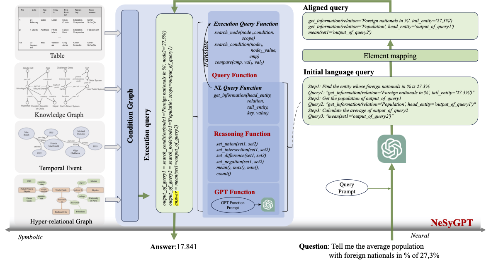
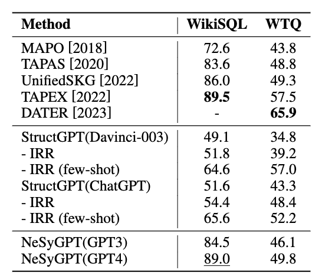
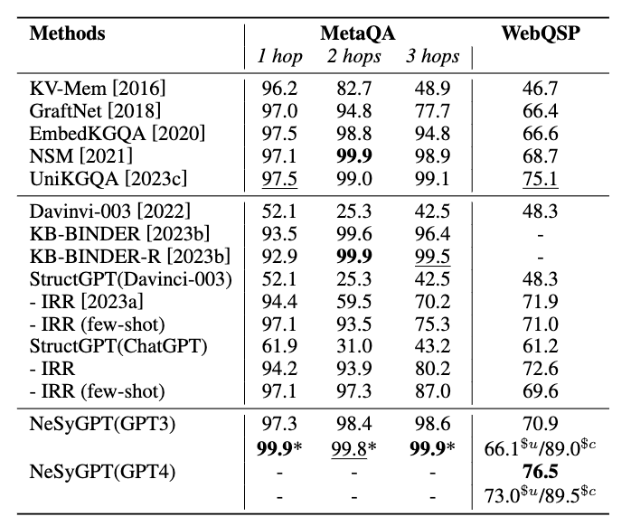
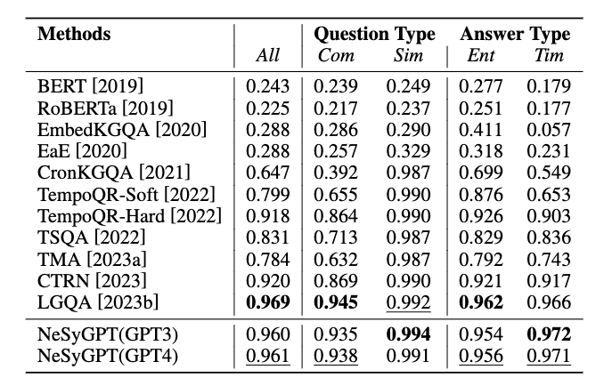

# NeSyGPT: A Unified Neural-Symbolic Framework for Structured Knowledge Querying with Large Language Model
-----
## 🌈 Model Architecture



## 📕 Dependencies
```bash
pip install -r requirement.txt
```
## 💡 **Quick start**

```bash
# WikiSQL
>> bash scripts/wikisql/wikisql_gpt3.5.sh
>> bash scripts/wikisql/wikisql_gpt4.sh

# WTQ
>> bash scripts/WTQ/WTQ_gpt3.5.sh
>> bash scripts/WTQ/WTQ_gpt4.sh

# MetaQA
>> bash scripts/MetaQA/metaqa_1hop.sh
>> bash scripts/MetaQA/metaqa_2hop.sh
>> bash scripts/MetaQA/metaqa_3hop.sh

# WebQSP
>> bash scripts/WQSP/wqsp3.5/WQSP_overall_gpt3.5.sh
>> bash scripts/WQSP/wqsp4/WQSP_overall_gpt4.sh

# CronQuestion
>> bash scripts/CronQuestion/CronQuestion_gpt3.5.sh
>> bash scripts/CronQuestion/CronQuestion_gpt4.sh
```

## 📚 Code path
<details>
    <summary>👈 🔎 Click</summary>

```
root
├── dataset
├── evaluate
├── output
├── scripts
├── structllm
│   └── prompt_
├── api_key.txt
├── CGdata_for_CronQuestion.py
├── CGdata_for_KGQA.py
├── CGdata_for_tableqa.py
└── CGdata_for_WQSP.py
```
</details>

#### Data Path

❗NOTE: The data we provide is the data after **conversion to CGdata**.

<details>
    <summary>👈 🔎 Click</summary>

```
dataset
  ├── CronQuestion_CG
  │   ├── kg_test.txt
  │   ├── kg.txt
  │   ├── qa_test.jsonl
  │   └── qa_valid.jsonl
  ├── MetaQA_CG
  ├── WikiSQL_CG
  ├── WikiSQL_TB_csv
  ├── WQSP
  ├── WTQ
  └── deal_raw.py
```
</details>

#### Evaluate Path

<details>
    <summary>👈 🔎 Click</summary>

```
evaluate
  ├── evaluate_for_CronQuestion.py
  ├── evaluate_for_metaqa.py
  ├── evaluate_for_tableqa.py
  └── evaluate_for_wqsp.py
```
</details>

#### Prompt Path

<details>
    <summary>👈 🔎 Click</summary>

```
prompt_
   ├── MetaQA
   │   ├── 1hop.json
   │   ├── 2hop.json
   │   └── 3hop.json
   ├── WQSP
   │   ├── WQSP_name.json
   │   └── WQSP_unname.json
   ├── CronQuestion.json
   ├── wikisql.json
   └── WTQ.json
```
</details>

## 🎯 Results

#### Result on TableQA dataset
<div align="center">

</div>

#### Result on KGQA dataset
<div align="center">

</div>

#### Result on CronQuestion dataset
<div align="center">

</div>